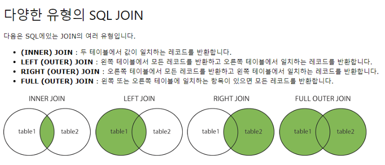

# SQL Joins

## 조인을 하는 이유
* 관계형 DB를 구축하기 위함입니다.
* 데이터가 중복되는 현상을 막고, 데이터 UPDATE시 변경의 연산이 적어지며 처리 속도 역시 빨라집니다.

---

## 예제 테이블
### users
id | name | language_id | framework_id
---|------|-------------|--------------
1 | Jo | 1 | 1
2 | Min | 2 | 10
3 | Kuk | 3 | 3
4 | Like | 4 | 4
5 | Lion | 5 | 5
6 | Dev | 6 | 6
7 | Dogs | 7 | 7

### languages
id | language
---|----------
1 | Java
3 | TypeScript
4 | Ruby
5 | Python
6 | Swift
7 | Kotlin
8 | JavaScript

### framewords
id | frameworkName
---|---------------
1 | Spring MVC
2 | Angular
3 | Rails
4 | Django

---

## INNER JOIN
SELECT u.name, l.languageName 
FROM users u 
INNER JOIN languages l ON u.language_id = l.id;

### 결과 테이블
name | languageName
-----|--------------
Jo | Java
Kuk | TypeScript
Like | Ruby
Lion | Python
Dev | Swift
Dogs | Kotlin

---

## LEFT JOIN
SELECT u.name, l.languageName 
FROM users u 
LEFT JOIN languages l ON u.language_id = l.id;

### 결과 테이블
name | languageName
-----|--------------
Jo | Java
Min | **NULL**
Kuk | TypeScript
Like | Ruby
Lion | Python
Dev | Swift
Dogs | Kotlin

---

## RIGHT JOIN
SELECT u.name, l.languageName 
FROM users u 
LEFT JOIN languages l ON u.language_id = l.id;

### 결과 테이블
name | languageName
-----|--------------
Jo | Java
Kuk | TypeScript
Like | Ruby
Lion | Python
Dev | Swift
Dogs | Kotlin
NULL | JavaScript

---

## 3개 테이블 JOIN
SELECT u.name, l.languageName, f.frameworkName 
FROM (()users u 
INNER JOIN languages l ON u.language_id = l.id) 
INNER JOIN frameworks f ON u.framework_id = f.id);

### 결과 테이블
name | languageName | frameworkName
-----|--------------|---------------
Jo | Java | Spring MVC
Kuk | TypeScript | Rails
Like | Ruby | Django