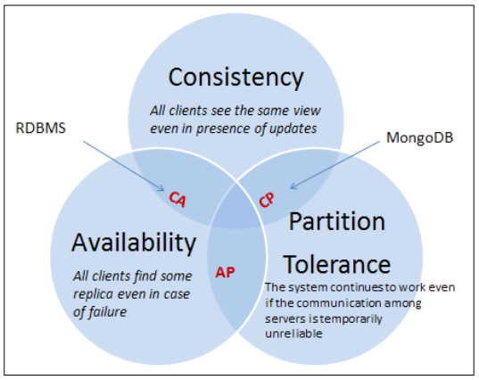

# NoSQL 개념 & 특징
* SQL 명령을 지원하지 않습니다.
* 트랜잭션을 지원하지 않습니다.
* 많은 서버에 분산하여 데이터를 저장, 처리, 조회할 수 있습니다.

## 일관성 (Consistency)
* 하나의 시스템이 여러 서버 컴퓨터에 분산되어 실행될 때, 각각의 컴퓨터를 노드(node)라고 합니다.
* NoSQL DB에서 분산 노드에 데이터를 저장하는 방법은 동기식과 비동기식이 있습니다.

### 동기식(Synchronized) 저장 방법
* 모든 노드에 데이터가 저장된 후, 데이터의 저장 결과를 클라이언트로 응답하는 방식입니다.
* 데이터 저장에 실패한 노드가 하나라도 있으면, 전체 작업이 실패합니다.
* 장점: 데이터의 일관성
* 단점: 느린 응답 시간

### 비동기식(Asynchronized) 저장 방법
* 어느 한 노드에 저장 명령이 요청되고, 그 노드에 데이터가 저장되자마자 데이터 저장 완료 응답이 클라이언트에 전송됩니다.
* 그 후, 데이터 저장 명령이 다른 노드들에 전파됩니다.
* 어느 노드에서 데이터 저장이 실패하더라도 클라이언트는 이 사실을 알 수 없습니다.
* 장점: 빠른 응답 시간
* 단점: 데이터 불일치 발생 가능

---

## CAP
* 분산 DB 시스템에 갖춰야 할 중요한 요구사항은 다음과 같습니다.

### Consistency 데이터의 일관성
* 모든 노드에서 동일한 시각에 동일한 데이터가 조회되어야 합니다.
* 동일한 시각에 데이터를 조회하는 모든 클라이언트들은 동일한 결과를 조회해야 합니다.
* 즉, 데이터 쓰기는 모든 노드에서 쓰기가 성공했는지 확인되어야 합니다.

### Availability 가용성
* 모든 요청에 대한 성공 또는 실패 결과가 즉시 클라이언트에 반환되어야 합니다.
* 어떤 노드가 클라이언트의 명령을 받았다면, 그 명령의 처리 결과가 타임아웃에 걸리지 않고 즉시 클라이언트에게 응답되어야 합니다.
    > 명령의 처리 결과가 실패일 수도 있습니다.

### Partition Tolerrance 분할 용인
* 분산된 노드들 사이의 통신에 장애가 발생하더라도 전체 시스템은 계속 작동해야 합니다.

* 위 3가지 요구사항을 모두 만족하는 분산 DB 시스템을 구현하는 것은 불가능합니다.
* 따라서, 2개의 요구사항을 선택해야 합니다.

---

### CP (Consistency + Partition Tolerrance)
* 동기식 저장 방법을 사용하는 분산 DB 시스템들은 CP를 선택하고 A를 포기합니다.
* 동기식 저장 방법의 단점은 느린 응답 시간이고, 느린 응답 시간은 Availability가 포기되었음을 의미합니다.

### AP (Availability + Partition Tolerrance)
* 비동기식 저장 방법을 사용하는 분산 DB 시스템들은 CA를 선택하고 P를 포기합니다.
* 비동기식 저장 방법의 단점은 데이터 불일치 발생 가능이고, Consistency가 포기되었음을 의미합니다.

### MongoDB는 CP입니다.

---

## Schema less
* DB에 저장할 데이터의 구조를 정의한 것을 DB 스키마라고 합니다.
* RDB에서 DB 스키마는 엄격하게 관리됩니다.
* 데이터를 저장하기 전, DB 스키마가 정의되어야 하고 DB 스키마의 변경은 엄격히 통제되어야 합니다.
* NoSQL DB에서 DB 스키마는 RDB보다 훨씬 더 느슨하게 관리됩니다.
    > DB 스키마의 변경이 비교적 쉽다는 의미입니다.
    
## 트랜잭션 지원
* MongoDB에서 쓰기 작업 1개는 atomic 합니다.
* 그런데 쓰기 작업 여러 개를 묶어서 atomic 하게 처리하는 기능을 MongoDB가 지원하지 않습니다.