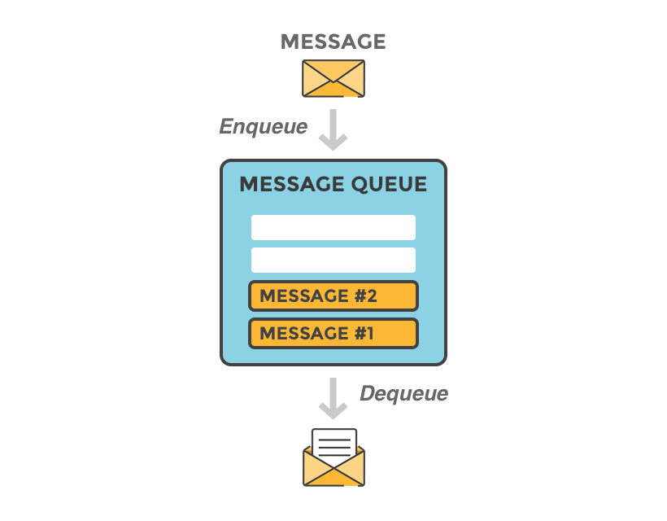
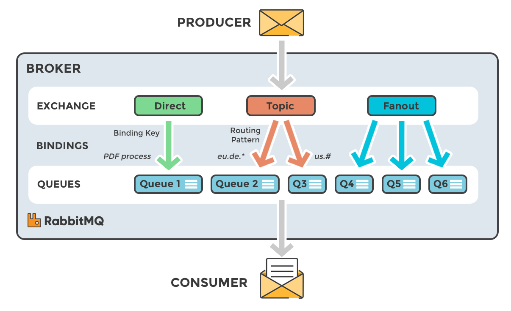
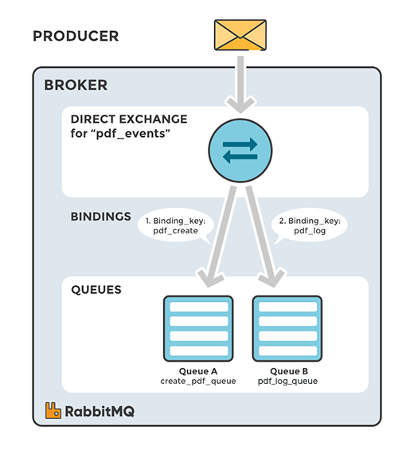
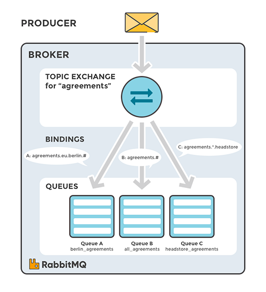

# RabbitMQ
* AMQP(Advanced Message Queueing Protocol) message broker software 오픈소스
> AMQP란 표준 MQ 프로토콜
* 모든 이미지 출처: https://www.cloudamqp.com

## Contents
* [Work Flow](#Work-Flow)
  * [Round-Robin Dispatch](#메시지-분배)
  * [Fair Dispatch](#공평한-분배)
* [Exchange](#Exchange-(type-of-exchange))
  * [Direct](#Direct-Exchange)
  * [Fanout](#Fanout-Exchange)
  * [Topic](#Topic-Exchange)
  * [Headers](#Headers-Exchange)
  
---

## Work Flow

* Broker는 Producer와 Consumer 사이 중간자 역할을 담당한다.
* Message는 Queue에 저장되어 Consumer가 조회할 때까지 저장된다.

### 메시지 분배
**Round-Robin dispatch** 
RabbitMQ는 Consumer가 병렬 처리를 쉽게 할 수 있도록 같은 Queue를 바라보는 Consumer에게 메시지를 균등 분배한다.

### 공평한 분배
**Fair dispatch** 
여러 Consumer에게 번갈아가며 메시지를 전달하지만 완벽하게 공평하진 않다. 
그렇기 때문에 busy한 서버에 메시지를 전달하지 않도록 prefetchCount라는 개념을 사용한다. 
prefetchCount가 1일 때, 아직 ACK를 받지 못한 Message가 1개라도 있으면 이 Consumer에는 Message를 할당하지 않는다.
> prefetchCount는 동시에 보내는 Message 수

---

## Exchange (type of exchange)
Producer는 Message를 바로 Queue로 Publishing하는 것이 아니라 Exchange로 보내고, 
Exchange는 다른 Queue에게 Message를 Routing한다.

### Direct Exchange
Message의 Routing Key와 정확히 일치하는 Binding Queue로 Routing

### Fanout Exchange
Binding된 모든 Queue로 Routing

### Topic Exchange
Routing 패턴이 일치하는 Queue로 Routing

### Headers Exchange
key-value로 정의된 Header 속성을 통한 Routing

---

### Exchange 설정값
**Durability**
* Broker가 재시작될 때 남아 있는지 여부
    * durable: 재시작해도 유지
    * transient: 재시작하면 삭제
    
**Auto-delete**
* 마지막 Queue 연결이 해제되면 삭제