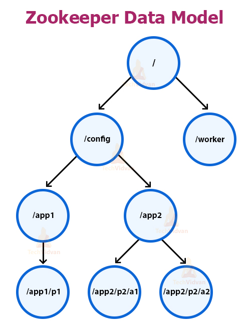

# Apache Zookeeper
* 분산 시스템을 다룰 때 사용되는 중요한 서비스 중 하나
* 트리 구조로 데이터를 저장할 수 있지만, 많은 양의 데이터 보관에는 적합하지 않음
* 제어와 조율을 위한 데이터를 저장하는 것이 좋음(주키퍼가 직접 비즈니스 작업을 조율하는 것은 아니다.)

## 트리 구조

> 이미지 출처: https://techvidvan.com/tutorials/apache-zookeeper-tutorial/

* 주키퍼는 트리로 데이터를 관리하고, 트리의 노드는 데이터를 저장할 수 있는 노드이며, 주키퍼의 트리 내에서 관리되어 znode라고 부른다.
* znode 데이터에 접근하는 action은 모두 atomic operation이다. 즉, data의 일부만 변경하거나 읽을 수 없다.

## Znode mode
**persistent** 
이름에서도 알 수 있듯이 delete 명령으로 지우지 않는 한 znode가 사라지지 않는다.

**ephemeral** 
crash가 발생하거나 주키퍼와 연결이 끊어질 경우 삭제된다. (자식 노드를 가질 수 없음)

**persistent_sequential, ephemeral_sequential** 
znode가 생성될 때 이름에 정수(1, 2, 3 ...)가 순차적으로 붙는다.

## Watch & Notification
주키퍼는 클라이언트의 폴링없이 znode의 변화를 알 수 있도록 알림을 준다. 클라이언트는 주키퍼의 znode에 대한 Watch를 등록하기만 하면 된다. 
Watch가 알림을 받는 방식은 one-shot이므로 알림을 받은 후에 다시 Watch를 등록해야 이후 알림을 받을 수 있다.

## 주키퍼 구조
**standalone** 
말그대로 하나의 주키퍼 서버.

**quorum** 
주키퍼 서버들이 하나의 앙상블을 이루고 있는 형태이고, 각각의 주키퍼가 가지고 있는 상태를 복제하여 일관성을 유지한다. 
주키퍼가 클러스터가 아닌 쿼럼으로 구성된 가장 큰 이유는 서버 전체가 일관성 있는 정보를 갖도록 해야 하기 때문이다.
