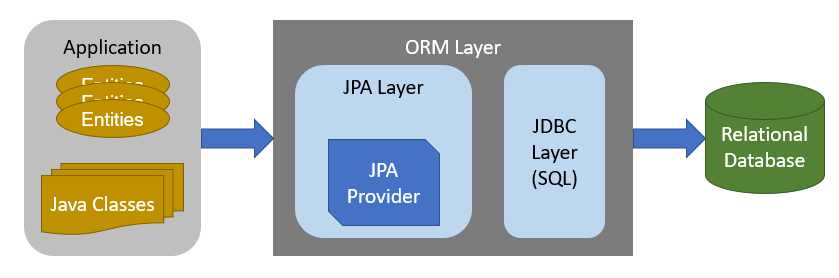
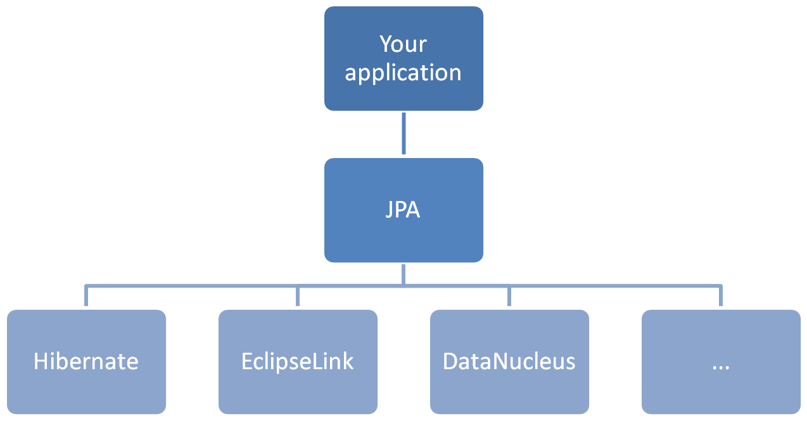

# JPA (Java Persistence API) ?
* JPA는 자바 진영의 ORM 기술 표준
* 애플리케이션과 JDBC API 사이에서 동작

## ORM (Object-Relational Mapping)
* 객체와 관계형 DB를 맵핑한다는 뜻
* ORM 프레임워크는 객체와 테이블을 맵핑하여 ```패러다임의 불일치``` 문제를 개발자 대신 해결한다.



> 이미지 출처: http://www.thistechnologylife.com/object-persistence-with-jpa/


> 이미지 출처: https://stackoverflow.com/questions/4477082/what-is-a-jpa-implementation
