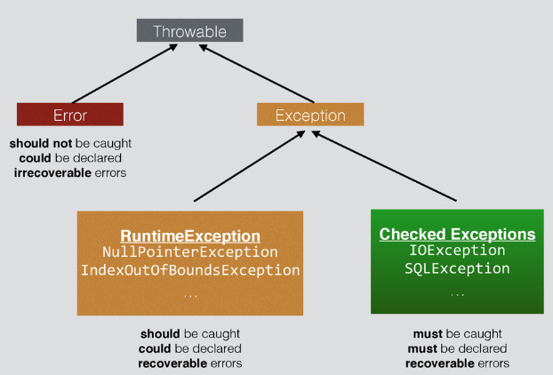

# Exception Handling
* Error Propagation 문제 해결
    > 메소드 리턴 값을 확인해서 에러 발생 여부를 확인해야 한다면 
    에러를 확인하기 위한 if 문이 메소드 호출마다 달리게 된다. (가독성이 크게 나빠진다.)  
    try 블럭에는 정상적인 로직만 구현하고, 에러 처리 로직은 catch 블럭에 구현할 수 있어 가독성이 향상된다.
    
* 자원 반납 문제
    > 에러가 발생하여 리턴하기 전, close(), unlock() 등 자원 반납 메소드를 호출해야 한다. 
    에러를 확인하기 위한 if 문에서 자원 반납을 구현해야 한다면, 자원 반납을 빼먹는 실수를 하기 쉽다.  
    자원 반납을 finally 블럭에 모아 구현하면, 빼먹는 실수를 할 가능성이 낮아진다. 
    try with resource 문법을 활용하면, 더욱 간결하고 안전하게 구현할 수 있다.

---

## Exception vs Error
* Bug
    > 문제의 원인 측면 
    문제의 원인이 프로그래머의 실수라는 것
* Error
    > 문제의 증상 측면 
    작업을 계속할 수 없는 어떤 문제가 발생한 것  
    예를 들어, 기능에 버그는 있지만, 에러는 발생하지 않고 넘어갈 수도 있다. 
    버그가 없어도, 기계 고장으로 에러가 발생할 수 있다.
* Exception
    > 문제 처리의 측면 
    주요 작업 로직 처리에서 분기되어야 할 상황이 발생한 것  
    예를 들어, 사용자가 입력한 날짜의 포맷이 바르지 않다면 
    메시지를 표시하고, 입력 화면으로 다시 넘어가야 한다.
    

* Throwable
    > try catch 블럭에서 catch 될 수 있는 객체들의 부모 인터페이스
* Error
    > catch 해서 작업을 계속 진행할 수 없고, 작업을 중단해야 하는 에러 
    따라서 catch 되지 않는 것이 바람직하다.
* RuntimeException
    > catch 블럭으로 분기해서 작업을 계속 진행할 수 있는 예외 상황 
    catch 해서 작업을 계속 진행하는 것이 바람직하다.
* Checked Exceptions
    > catch 블럭으로 분기해서 작업을 계속 진행할 수 있는 예외 상황 
    catch 해서 작업을 계속 진행해야 한다. 
    try catch 블럭으로 구현되거나 메소드 앞부분에 throws 선언이 있어야 한다.
    
    > RuntimeException 클래스의 자식은 아니면서, Exception 클래스의 자식인 클래스는 모두 Checked Exceptions 이다. 
     (CheckedException 이라는 클래스가 있는 것은 아니다.)