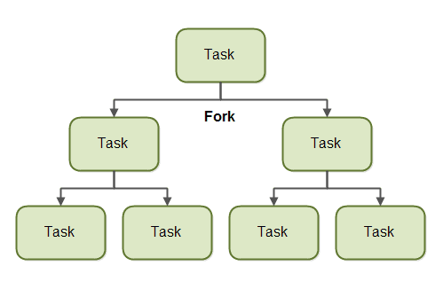
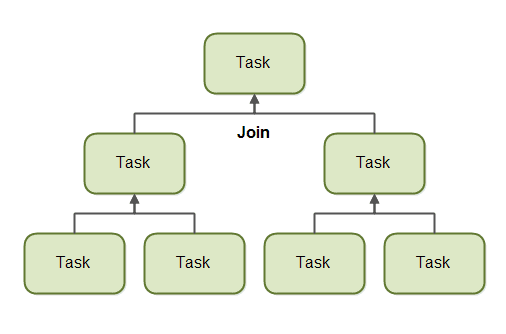

# ForkJoinPool
ForkJoinPool은 ExecutorService와 유사, Thread Pool을 생성해 여러 작업을 병렬로 수행할 수 있다. 
다른 부분은 Task의 크기에 따라 분할(Fork)해서 분할된 Task가 처리되면 합쳐(Join) 리턴해준다.

## Fork
Task를 분할해 다른 스레드에서 처리한다는 의미


> 이미지 출처: http://tutorials.jenkov.com/java-util-concurrent/java-fork-and-join-forkjoinpool.html

## Join
다른 스레드에서 처리되는 결과를 기다렸다가 합친다는 의미. 
즉, Parent는 Child에서 처리되는 Task가 완료될 때까지 기다린 후 결과를 합쳐 상위 Parent로 전달한다.


> 이미지 출처: http://tutorials.jenkov.com/java-util-concurrent/java-fork-and-join-forkjoinpool.html

## RecursiveAction & RecursiveTask
RecursiveAction과 RecursiveTask는 Task를 대표하는 클래스. 
ForkJoinPool에서 어떤 Task를 처리하려면 이 2개의 클래스를 사용해야 한다.

**RecursiveAction** : 리턴 값이 없는 Task
**RecursiveTask** : 리턴 값이 있는 Task

## Code Example
[Java-Code-Example](https://github.com/J-minkuk/Java-Code-Example/tree/master/src/com/study/forkjoinpool)

### RecursiveAction 구현
```java
class ActionApp {
    static void main(String[] args) {
        ForkJoinPool forkJoinPool = new ForkJoinPool(4);
        MyRecursiveAction myRecursiveAction = new MyRecursiveAction(128);
        forkJoinPool.invoke(myRecursiveAction);
    }
}

```
```java
class MyRecursiveAction extends RecursiveAction {

    private long workLoad;

    public MyRecursiveAction(long workLoad) {
        this.workLoad = workLoad;
    }

    @Override
    protected void compute() {
        String threadName = Thread.currentThread().getName();

        if (this.workLoad > 16) {
            System.out.println("[" + threadName + "] Splitting workLoad : " + this.workLoad);

            List<MyRecursiveAction> subtasks = new ArrayList<>(this.createSubtasks());

            for (MyRecursiveAction subtask : subtasks) {
                subtask.fork();
            }
        } else {
            System.out.println("Doing workLoad myself: " + this.workLoad);
        }
    }

    private List<MyRecursiveAction> createSubtasks() {
        List<MyRecursiveAction> subtasks = new ArrayList<>();

        MyRecursiveAction subtask1 = new MyRecursiveAction(this.workLoad / 2);
        MyRecursiveAction subtask2 = new MyRecursiveAction(this.workLoad / 2);

        subtasks.add(subtask1);
        subtasks.add(subtask2);
        return subtasks;
    }

}
```

### RecursiveTask 구현
```java
class TaskApp {
    public static void main(String[] args) {
        ForkJoinPool forkJoinPool = new ForkJoinPool(4);
        MyRecursiveTask myRecursiveTask = new MyRecursiveTask(128);
        Long mergedResult = forkJoinPool.invoke(myRecursiveTask);
        System.out.println("mergedResult = " + mergedResult);
    }
}
```
```java
class MyRecursiveTask extends RecursiveTask<Long> {

    private long workLoad;

    public MyRecursiveTask(long workLoad) {
        this.workLoad = workLoad;
    }

    @Override
    protected Long compute() {
        String threadName = Thread.currentThread().getName();

        if (this.workLoad > 16) {
            System.out.println("[" + threadName + "] Splitting workLoad : " + this.workLoad);

            try {
                Thread.sleep(1000);
            } catch (InterruptedException e) {
                e.printStackTrace();
            }
            List<MyRecursiveTask> subtasks = new ArrayList<>(this.createSubtasks());

            for (MyRecursiveTask subtask : subtasks) {
                subtask.fork();
            }

            long result = 0;
            for (MyRecursiveTask subtask : subtasks) {
                result += subtask.join();
            }
            return result;

        } else {
            System.out.println("Doing workLoad myself: " + this.workLoad);
            return workLoad * 3;
        }
    }

    private List<MyRecursiveTask> createSubtasks() {
        List<MyRecursiveTask> subtasks = new ArrayList<>();

        MyRecursiveTask subtask1 = new MyRecursiveTask(this.workLoad / 2);
        MyRecursiveTask subtask2 = new MyRecursiveTask(this.workLoad / 2);

        subtasks.add(subtask1);
        subtasks.add(subtask2);
        return subtasks;
    }

}

```
