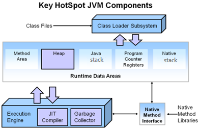
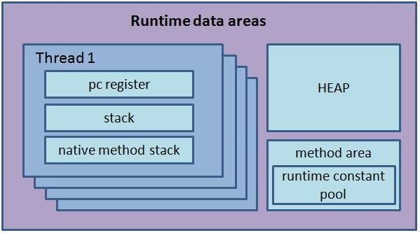

# HotSpot VM의 구조
* **Class Loader**: 클래스 파일(*. class)을 메모리에 불러오는 역할을 담당
* **Runtime Data Area**: 데이터를 보관하는 메모리 영역
* **Execution Engine**: 실행 엔진

## Runtime Data Area 구조
* **Method Area**
* **Heap**
* **Java Stack**
* **Program Counter Register**
* **Native Stack**

### Method Area에 위치한 항목들은 다음과 같습니다.
* method의 바이트 코드
* static 멤버 변수
* constant 값

### Heap
* Java 객체와 배열이 생성되는 영역입니다. (heap segment)
* 즉, GC는 heap 영역을 청소하는 작업입니다.

### Java Stack
* 지역 변수와 파라미터 변수가 생성되는 영역입니다.
* Java 메소드가 호출될 때, 그 메소드의 지역 변수와 파라미터 변수가 생성될 공간이 할당되어야 합니다.
* 이 공간은 메소드가 리턴될 때 반납되고, stack segment에 이 공간이 할당됩니다.
* Java 메소드가 호출될 때 사용되는 stack segment를 Java Stack이라고 합니다.
* **각 thread마다 stack segment를 따로 소유합니다.**
* 즉, 새 thread가 생성되면 그 thread가 사용할 stack segment를 새로 할당해야 합니다.

### Program Counter 레지스터 (PC 레지스터)
* 자바 스레드가 현재 실행하고 있는 명령(바이트 코드)의 주소가 pc 레지스터에 저장됩니다.
* CPU 코어의 address register와 유사한 역할을 합니다.
* **각 자바 스레드마다 pc 레지스터를 따로 소유해야 합니다.**

### Native Stack
* Java 표준 라이브러리의 클래스 메소드들 중 C로 구현된 메소드도 있습니다
* C로 구현된 메소드를 native method라고 부릅니다.
* C로 구현된 메소드가 호출될 때 사용될 stack segment를 Native Stack이라고 합니다.

---

## Heap 영역 구조

* Permanent Generation에는 클래스와 메소드에 대한 메타 정보가 저장됩니다.
* Java 8 이후부터는 Permanent Generation 영역의 이름이 Metaspace로 변경되었고, 
이 공간의 메모리 관리 기능도 개선되었습니다.

---

## Java Thread와 메모리 영역

### 각 Java Thread마다 따로 소유하는 메모리 영역
* Java Stack (지역 변수, 파라미터 변수)
* Program Counter 레지스터
* Native Stack

### 여러 Java Thread들이 공유하는 메모리 영역
* Method Area (상수, static 멤버 변수)
* Heap (객체, 배열)

