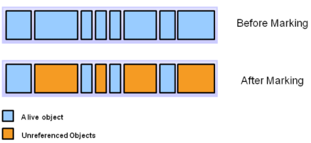
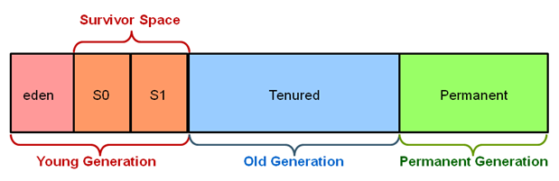

# Garbage Collection 과정
GC 과정(알고리즘)은 mark, sweep, compact 작업으로 구성됩니다.

## mark

* 더 이상 변수에 의해 참조되지 않는 객체가 garbage입니다.
* garbage를 찾는 작업이 mark입니다.
* 위 그림에서 marking 작업 결과 더 이상 참조되지 않는 객체들은 주황색으로 표시되었습니다.

## sweep

* mark 표시가 없는 객체는 변수에 의해 참조되지 않는 garbage입니다.
* garbage 객체를 삭제하는 작업이 sweep입니다.
* 더 이상 참조되지 않는 주황색 객체들을 삭제하면 위와 같은 그림이 됩니다.
* sweep 과정이 끝나면 빈 공간들이 흩어져 있게 되고, 새 객체를 생성할 때 적당한 빈 공간을 찾아야 하는 부담이 생깁니다.
* 객체를 생성하기에 너무 작은 빈 공간들이 객체들 사이에 존재하게 되어 메모리가 낭비됩니다.

## compact

* mark, sweep은 필수 작업이지만, compact는 필수가 아닙니다.
* sweep 작업 결과, 삭제되지 않고 살아 남은 객체들은 메모리에 듬성 듬성 위치하게 됩니다.
* 이 객체들을 한쪽으로 몰아, 
객체들이 차지하는 영역과 비어있는 영역을 구분하여 메모리에 빈 공간을 확보하는 작업을 compact라고 합니다.
* 새 객체를 생성할 때, 빈 공간의 시작 부분에 생성하면 되므로 빠릅니다.
* compact 작업에 시간이 걸리지만, 작업 후에는 객체 생성이 빠르고 메모리 낭비 또한 없습니다.

## Young generation & Old generation
생성된 객체의 대부분은 짧은 시간 안에 garbage가 됩니다. 따라서 효율적인 GC를 위해
메모리 영역을 young generation과 old generation 영역으로 나눕니다.
* 객체를 처음 생성할 때 young generation 영역에 생성합니다.
* young generation 영역에서 정해진 시간 이상 제거되지 않고 살아남은 객체는 old generation 영역으로 옮깁니다.
* old generation 영역으로 옮겨진 객체들은 비교적 오래 생존할 확률이 높습니다.
* 따라서, old generation 영역은 자주 청소할 필요 없이 가끔만 청소하면 됩니다.

## Minor GC & Major GC
* young generation 영역은 자주 청소해야 하는데, 이것을 Minor GC라고 부릅니다.
* 아주 가끔 young generation과 old generation 영역을 모두 청소해주어야 하는데 이것을 Major GC 또는 Full GC라고 부릅니다.

## Card Table
* old generation 영역 객체의 멤버 변수가 young generation 영역 객체를 참조하는 경우는 드뭅니다.
* old generation 영역 객체의 멤버 변수에 의해 참조되는 객체는 garbage가 아닙니다.
* 따라서, young generation 영역을 청소할 때, 
old generation 영역 객체의 멤버 변수들도 모두 검사하여 mark 작업을 해야 하는데, 이 작업에 많은 시간이 소요됩니다.
* 그래서 old generation 영역 멤버 변수가 young generation 영역 객체를 참조하는 경우, 
이 정보를 card table에 기록합니다.

### Card Table의 장단점
**장점**
* young generation 영역을 청소하기 위해 mark 할 때, 
old generation 영역 멤버 변수를 전부 검사할 필요없이 card table 기록만 보면 됩니다.

**단점**
* old generation 영역 멤버 변수에 young generation 영역 객체를 대입할 때마다 
card table에 그 정보를 기록해야 합니다.
* 단점보다 장점의 이득이 크기 때문에 card table을 사용하여 GC를 진행합니다.

## Heap 영역 구조

* Permanent Generation에는 클래스와 메소드에 대한 메타 정보가 저장됩니다.
* Java 8 이후부터는 Permanent Generation 영역의 이름이 Metaspace로 변경되었고, 
이 공간의 메모리 관리 기능도 개선되었습니다.