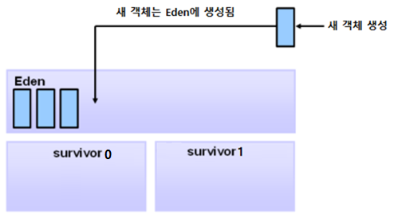
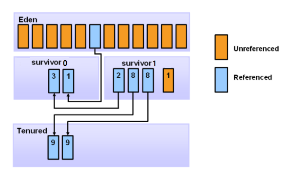

# Young Generation 영역의 GC 과정

## Eden 영역과 Survivor 영역

* young generation 영역은 1개의 Eden 영역과 2개의 Survivor 영역으로 나뉩니다.
* 두 Survivor 영역을 각각 survivor0, survivor1 이라고 하겠습니다.
* 처음 실행할 때, eden 영역과 두 survivor 영역 모두 빈 상태입니다.
* 생성된 객체는 처음에 eden 영역에 위치합니다.

### GC collection #1

* eden 영역이 가득차면, young generation 영역 전체(eden + 2개의 survivor)를 GC합니다. (mark, sweep)

* gc를 하고 난 후, eden 영역에서 살아남은 객체들을 전부 survivor0 영역으로 옮깁니다. (compact)
* survivor0 영역으로 이동된 객체의 살아남은 횟수를 1로 기록합니다.
* gc 결과, eden 영역과 survivor1 영역은 빈 공간이 됩니다. 

### GC collection #2

* 객체들이 생성되어 eden 영역이 또 가득차면, young generation 영역 전체를 GC합니다.
* eden 영역에서 살아남은 객체 전부를 비어있던 survivor1 영역으로 옮깁니다. 이 객체들의 살아남은 횟수를 1로 기록합니다.
* 그리고 survivor0 영역에서 살아남은 객체들도 survivor1 영역으로 옮깁니다. 이 객체들의 살아남은 횟수를 2로 기록합니다.

* gc 결과, eden 영역과 survivor0 영역은 빈 공간이 됩니다.

### GC collection #3

* 객체들이 생성되어 eden 영역이 또 가득차면, young generation 영역 전체를 GC합니다.
* eden 영역에서 살아남은 객체 전부를 비어있던 survivor0 영역으로 옮깁니다. 이 객체들의 살아남은 횟수를 1로 기록합니다.
* 그리고 survivor1 영역에서 살아남은 객체들도 survivor0 영역으로 옮깁니다. 이 객체들의 살아남은 횟수에 1을 더해 기록합니다.

* gc 결과, eden 영역과 survivor1 영역은 빈 공간이 됩니다.

## Old generation 영역으로의 승격

* 9번째 gc를 수행하면 살아남은 횟수가 9인 객체가 존재할 수 있습니다.
* 이 객체들은 old generation 영역으로 이동하게 됩니다.
* 즉, 특정 횟수의 minor gc에서 살아남은 객체들은 old generation 영역으로 승격합니다.

## Copying Controller
* young generation 영역의 GC 작업을 담당하는 엔진을 Copying Controller라고 부릅니다.
* young generation 영역의 GC는 mark 작업과 copy 작업으로 구성됩니다.
* mark 작업은 '포괄적인 GC 과정'에 설명되어 있으므로 생략합니다.

### copy 작업
* 두 survivor 영역 중 한 곳은 언제나 빈 공간입니다.
* mark 작업에서 식별된 후 살아남은, 즉, 여전히 참조되는 객체들을 빈 survivor 공간에 복사합니다.
