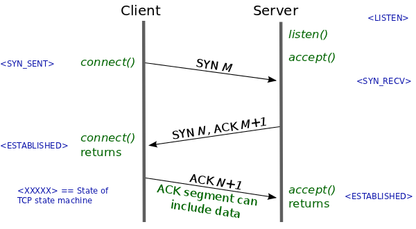
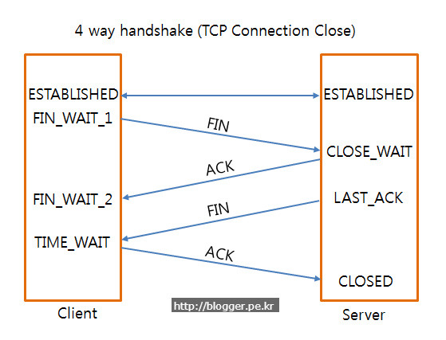

# 3-way-handshake & 4-way-handshake
* SYN: synchronize sequence number
* ACK: acknowledgement

## Why two types of packets ?
* 연결이 성립하려면 서로 통신이 가능한지 파악하기 위해 먼저 패킷을 주고 받아야 한다는 것까지는 이해하기 쉽습니다.
* 두 종류의 패킷을 주고 받습니다. **요청**과 **응답**에 대한 패킷을 주고 받아야 하기 때문에 두 종류인 것입니다.

## 연결 성립(Connection Establishment)
* 3-way-handshake

### 이미지 설명
1. 클라이언트는 서버에 접속을 요청하는 **SYN(M)** 패킷을 보냅니다.
2. 서버는 클라이언트의 요청인 **SYN(M)** 를 받고 
클라이언트에게 요청을 수락한다는 **ACK(M+1)** 와 **SYN(N)** 가 설정된 패킷을 발송합니다.
3. 클라이언트는 서버의 수락 응답인 **ACK(M+1)** 과 **SYN(N)** 패킷을 받고 **ACK(N+1)** 을 서버로 보냅니다.
4. 이렇게 되면 연결이 성립(establish)됩니다.

### 왜 3-way 일까?
* 클라이언트가 자신의 목소리가 들리는지 물어봅니다. (SYN)
* 서버는 클라이언트의 목소리가 들린다고 말합니다. (SYN + 1)
* 그리고, 서버 자신의 목소리가 들리는지 물어봅니다. (ACK)
* 클라이언트는 서버의 목소리가 들린다고 말합니다. (ACK + 1)

**TCP connection은 양방향성(bidirectional) connection입니다. 
클라이언트에서 서버에게 존재를 알리고 패킷을 보낼 수 있다는 것을 알리듯, 
서버에서도 클라이언트에게 존재를 알리고 패킷을 보낼 수 있다는 신호를 보내야 합니다. 
그렇기 때문에 2-way-handshake로는 부족합니다.**

---

## 연결 해제(Connection Termination)
* 4-way-handshake

### 이미지 설명
1. 클라이언트가 연결을 종료하겠다는 **FIN 플래그**를 전송합니다.
2. 서버는 클라이언트의 요청(FIN)을 받고 알겠다는 확인 메시지로 **ACK**를 보냅니다. 
그 후, 데이터를 모두 보낼 때까지 잠시 **TIME_OUT** 됩니다.
3. 데이터를 모두 보낸 후, 통신이 끝났으면 연결이 종료된 것을 알리기 위해 클라이언트에게 **FIN 플래그**를 전송합니다.
4. 클라이언트는 FIN 메시지를 확인했다는 **메시지(ACK)** 를 보냅니다.
5. 클라이언트의 ACK 메시지를 받은 서버는 소켓 연결을 close 합니다.
6. 클라이언트는 아직 서버로부터 받지 못한 데이터가 있을 것을 대비해 일정 시간 동안 세션을 남겨놓고 
잉여 패킷을 기다리는 과정을 거칩니다.(TIME_WAIT)
