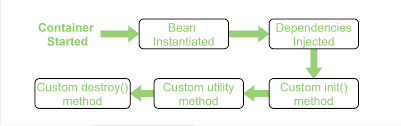

# Spring DI 요약 정리

* IoC Container == ApplicationContext
* IoC Container는 Bean의 생명 주기를 담당한다.

## Bean's Life Cycle

1. Bean Scan -> Bean Instantiated
    > Dependencies Injected
2. Bean Instantiated -> custom init method가 존재하면 init 실행
    > @PostConstruct
3. utility method
    > initializingBean -> afterPropertiesSet