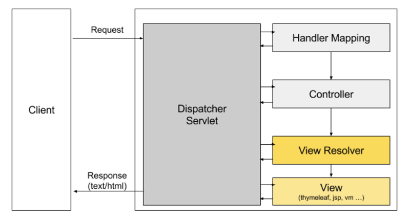
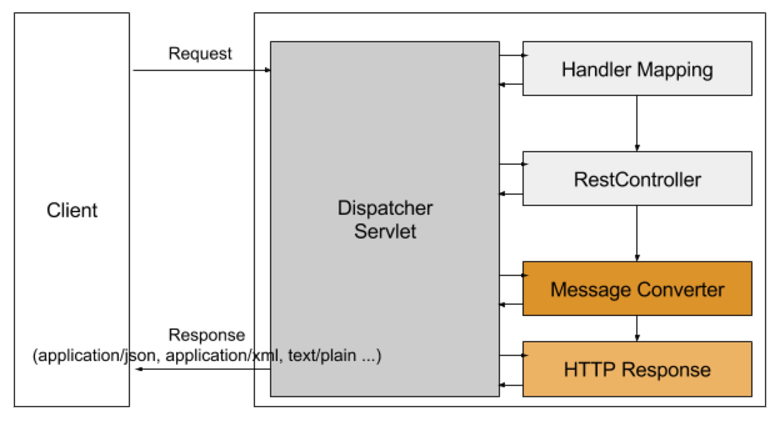

# @RestController

## @RestController의 동작 방식
* @RestController는 @Controller 어노테이션과 @ResponseBody 어노테이션을 합쳐놓은 어노테이션입니다.
* 클래스 상단에 @RestController 어노테이션을 선언하면 아래의 코드와 동일하게 동작합니다.

```
@Controller
@RequestMapping("/rests")
public class JacksonController {
    @GetMapping("/text")
    @ResponseBody
    public String getPlainText() {
        return "Hello, World!";
    }
}
```

## @Controller와 @RestController의 차이
### @Controller
* Spring Framework는 일반적으로 view 이름을 리턴하여 사용자에게 뷰를 통해 출력되게 되어있습니다.
* 사용자의 요청이 오면 등록된 <code>ViewResolver</code>를 통해 서버 템플릿을 하여 사용자에게 <code>text/html</code>타입의 응답을 보내게 됩니다.

```
@Controller
public class IndexController {
    @GetMapping("/")
    public String index() {
        // ViewResolver에 등록된 template resource 패스를 확인하여 서버 템플릿 후 text/html 컨텐츠 타입을 리턴
        return "index";
    }
}
```


### @RestController
* @Controller에 반해 @RestController에서 return 되는 값은 view를 통해서 출력되는 것이 아니라
HTTP ResponseBody에 직접 쓰여지게 됩니다.
* @ResponseBody 는 값을 리턴할 타입을 보고 알맞은 MessageConverter를 찾아 적절한 응답 형태로 변환한 후 Http ResponseBody에 직접 쓰여 응답을 해주는 것입니다.

```
@RestController
@RequestMapping("/students")
public class StudentRestController {
    @Autowired
    private StudentService studentService;
    
    @GetMapping("/one")
    public ResponseEntity<Student> getStudent() {
        // MappingJackson2HttpMessageConverter를 통해서 application/json 컨텐츠 타입을 리턴
        return studentService.getStudent();
    }
    
    @GetMapping("/text")
    public String getText() {
        // StringHttpMessageConverter를 통해서 text/plain 컨텐츠 타입을 리턴
        return "Hello, Rest";        
    }
}
```


## MessageConverter
* 적절한 응답을 하기 위해 응답을 바꿔주는 MessageConverter들은 HttpMessageConverter 인터페이스를 상속 받고 있습니다.
* 몇가지 대표적은 응답을 해주는 MessageConverter는 다음과 같습니다.
    * application/json 형태의 응답: MappingJackson2HttpMessageConverter
    * application/xml 또는 text/xml 형태의 응답: MarshallingHttpMessageConverter
* 이외에도 다양한 종류의 응답 형태로 변환해주는 MessageConverter가 있습니다.
    > Spring Boot 기반에서는 대부분의 MessageConverter를 <code>spring-boot-starter-web</code> 의존성을 통해 자동으로 세팅합니다.
    
## MappingJackson2HttpMessageConverter 동작 방식

### org.codehaus.jackson VS com.fasterxml.jackson.core
* json 형태의 Http 응답으로 바꿔주는 라이브러리는 대표적으로 2가지가 있습니다.
* 결론적으로, com.fasterxml.jackson.core 라이브러리를 사용해야 합니다. (현재까지도 꾸준히 관리되고 있는 라이브러리이기 때문입니다.)

