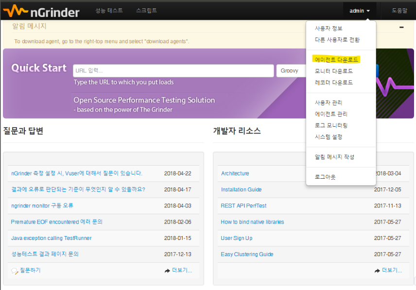

# nGrinder 설치 및 사용

### Step 1 - nGrinder 설치
* 아래 url에서 ngrinder-controller-3.4.1.war 파일을 다운로드 합니다. (최신 3.4.1 version) 
https://github.com/naver/ngrinder/releases

### Step 2 - nGrinder 실행
* 다운로드한 war 파일을 넣은 폴더에 들어가 cmd를 실행합니다.
* 아래 명령어를 입력합니다. 
(보통 로컬에서 8080 포트를 사용하기 때문에 -p 7777로 포트를 변경합니다.)
* java -XX:MaxPermSize=200m -jar ngrinder-controller-3.4.1.war -p 7777

### Step 3 - nGrinder 로그인
* cmd 창에 마지막 줄 메세지로 @Started ????ms이 보여진다면 실행이 된 것입니다.
* http://127.0.0.1:7777 에 접속합니다. (한글을 지원합니다. ID: admin // PW: admin)

### Step 4 - 에이전트 다운로드 및 실행
오른쪽 상단 admin을 누르고 나오는 메뉴에서 '에이전트 다운로드'를 클릭합니다.

* 다운로드 받은 파일의 압축을 풀고
   * Windows는 run_agent.bat를 실행합니다.
   * Mac은 run_agent.sh를 cmd에서 실행합니다.

### Step 5 - 스크립트 만들기
위 첨부된 그림 왼쪽 상단 스크립트를 클릭합니다. 그럼 아래와 같은 뷰를 볼 수 있습니다.

   * 스크립트명 (이름을 지어줍니다.)
   * 테스트 할 URL (http://127.0.0.1/...)
* 만들기 버튼을 클릭하면 기본 스크립트가 자동으로 생성됩니다.

### Step 6 - 성능 테스트
* 스크립트 버튼 옆에 있었던 성능 테스트 -> 테스트 생성을 클릭합니다.

테스트 설정

옵션 | 설명
-----|------
에이전트 | test로 사용할 agent 수 (Step 4에서 agent를 1개만 생성했으니 max 1까지 가능)
에이전트 별 가상 사용자 | agent 별 call 보낼 수
스크립트 | call 보낼 스크립트 (만든 스크립트를 선택합니다.)
테스트 기간 | 얼마동안 call을 보낼지 설정
Ramp-Up 사용 | 테스트할 때 점점 부하를 줄 것인지의 여부 선택 (Process or Thread)
