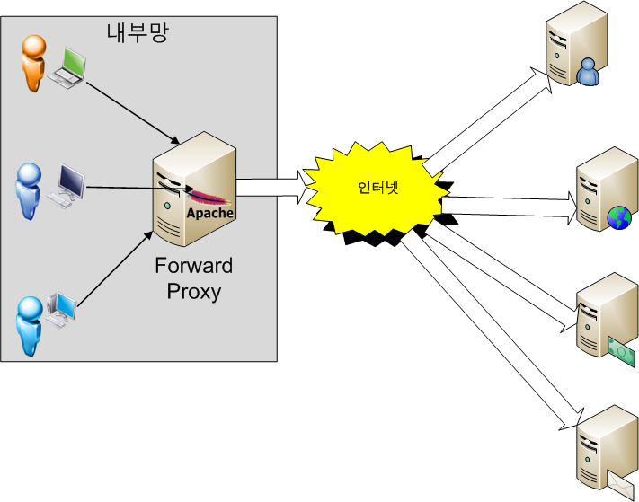

# Forward & Reverse Proxy

## Forward Proxy

* 클라이언트가 ```example.com```에 연결하려고 하면 사용자 PC가 직접 연결하는게 아니라<br>
포워드 프록시 서버가 요청을 받아 ```example.com```에 연결하여 그 결과를 클라이언트에게 전달(forward)해준다.
* 포워드 프록시는 보통 캐싱 기능이 있으므로 자주 사용되는 컨텐츠라면 월등한 성능 향상을 가져올 수 있으며,<br>
정해진 사이트만 연결하게 설정하는 등 웹 사용 환경을 제한할 수 있다.

## Reverse Proxy

* 클라이언트가 ```example.com``` 웹 서비스에 데이터를 요청하면,<br>
리버스 프록시는 이 요청을 받아 내부 서버에서 데이터를 받은 후 클라이언트에게 전달한다.
* 내부 서버가 직접 서비스를 제공해도 되지만 이렇게 하는 이유는 보안 때문이다.
    > 리버스 프록시 서버를 두고 실제 서비스 서버는 내부망에 위치시킨다.<br>
    프록시 서버만 내부의 서비스 서버와 통신하여 결과를 클라이언트에게 제공하는 방식으로 서비스를 한다.