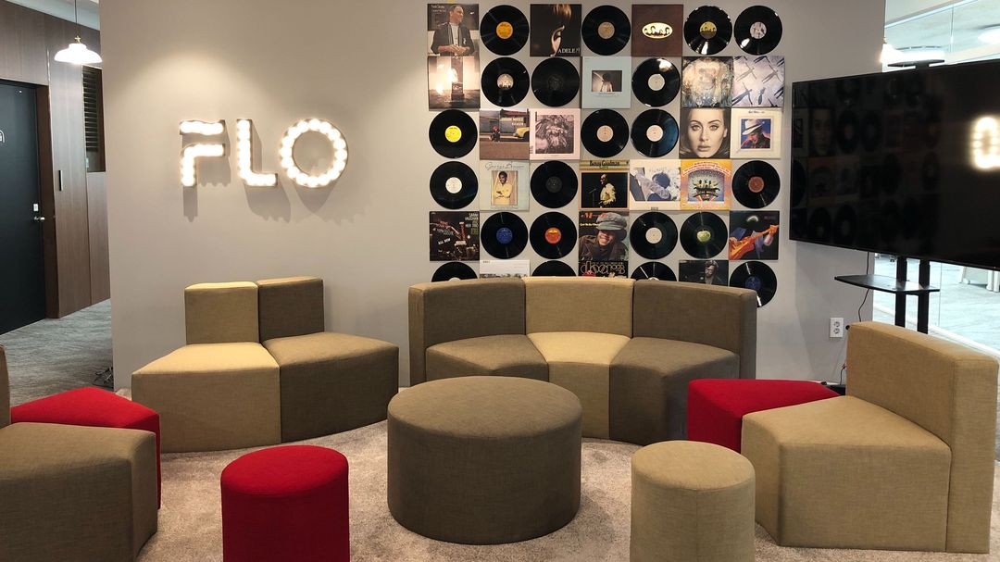
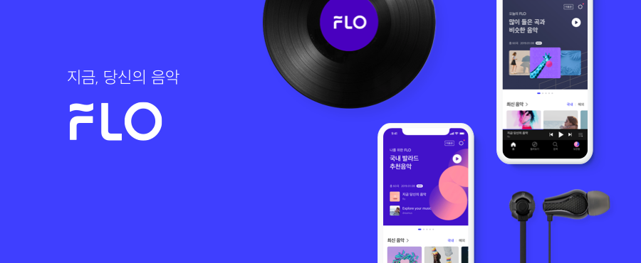
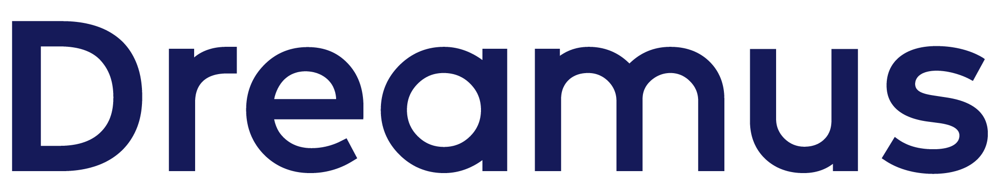
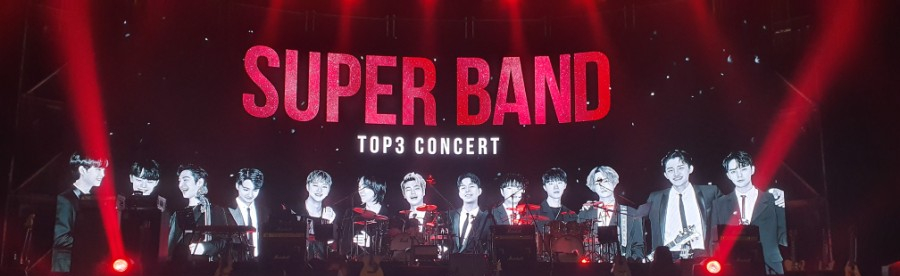
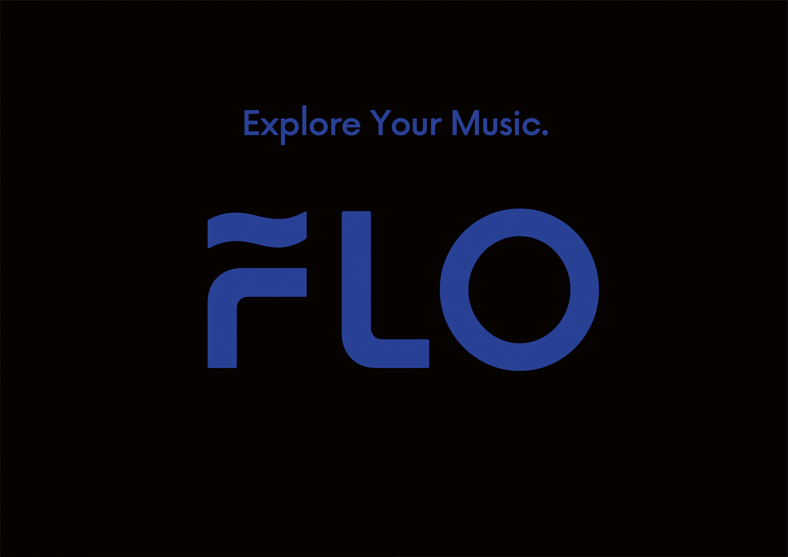

# 새로운 시작 2019년


## 서론
2019년 2월 대학교를 졸업하고, 운 좋게 '삼성 청년 소프트웨어 아카데미(이하 SSAFY)'에서 교육을 받을 수 있었다.<br>
나의 부족했던 알고리즘 역량을 채울 수 있었고, 
IT 기업만 바라보던 인생 계획에 없었던 삼성을 포함한 대기업에도 지원해 볼 수 있었다.
> 물론 나의 가치관이 바뀐 것은 아니었고, 주변 친구들이 했기 때문에 나도 한 번 지원해봤다.

참혹한 결과를 맛보고
> 서류가 삼성만 붙었다ㅋㅋㅋ 

다시금 '나는 역시 IT 기업이구나.'라는 것을 깨닫고 마음을 바로잡았다. 이후 자체 서비스를 개발하는 IT 기업에 포트폴리오로 지원을 했고, 
SSAFY를 시작하기 전을 포함해서 여러 IT 기업(N사, S사, D사 등)의 면접을 볼 수 있었다. 
서류 합격 과정에서 한 가지 신기했던 점은 SSAFY를 시작하기 전과 후 포트폴리오는 크게 변하지 않았고, 필요한 것과 필요하지 않은 것을 정리했을 뿐인데 결과가 너무나도 달랐다는 것이다.


다시 돌아가서, IT 기업들의 상시/경력 채용에 나름 패기롭게 실무 경험이 전무한 상태로 지원했었는데, 매우 감사하게도 많은 곳에서 면접을 보자고 제안해주셨고, 
그중 음악 스트리밍 서비스 'FLO'를 개발하는 'Dreamus Company(이하 Dreamus)'에서 나의 첫 인턴 생활을 시작할 수 있었다. 
> 정기적인 수입이 생기면 SSAFY는 더 이상 할 수 없기 때문에 나는 상반기 과정을 다 채우지 않고 SSAFY를 그만두게 됐다.

---

## 첫 인턴 생활의 시작 (2019.05.07)

개발자로서의 새로운 삶을 시작하게 해준 너무 감사한 Dreamus에서 인턴 생활을 시작하고 일주일이 지났을 때쯤 K 계열사의 서류 합격과 N 계열사의 임원 면접 일정 조율 연락을 받았다. 
하지만 나를 필요로 했던, 나에게 기회를 준 Dreamus의 사람들에게 등을 돌릴 수 없었고 앞으로 나에게 더 많은 기회가 있을 것이라는 생각이 있었기 때문에 두 기업에 모두 죄송하다는 연락을 드렸다.<br><br>

그렇게 모든 채용 과정을 정리하고 Dreamus의 개발자로서 전념하게 되었고, 처음으로 내가 맡은 일은 Admin 개발 및 유지 보수였다. 이 업무를 진행하면서 ```FLO```의 도메인 지식을 많이 습득할 수 있었고, 
실무에서 역량을 발휘하려면 개발 실력보다는 커뮤니케이션과 도메인 지식을 빠르게 습득하는 것, 그리고 남의 코드를 읽고 이해하는 능력이 굉장히 중요하다는 걸 느낄 수 있었다.<br>
> Git을 활용하는 것과 branch 전략을 이해하는 것은 매우 기본적인 것이었다. 다행히 Git을 학부생 때 많이 활용해봤기 때문에 이 부분은 도움 없이 할 수 있었다.

## 첫 상용 서비스 오픈

인턴 기간에 내가 맨땅부터 Release까지 담당했던 프로젝트가 있는데, 바로 ```슈퍼밴드 최종 우승자 투표 이벤트```다. 
이 프로젝트를 통해 처음으로 나의 코드가 상용 서비스에 반영되었다. 상용 서비스에서는 사용자의 개인 정보를 어떻게 다루는지 알 수 있었고, 
서비스 오픈 이후 내가 만든 서비스에 request가 들어오는 것을 30분 정도 지켜봤다. 에러가 발생하지 않고, 성공적으로 서비스되는 것을 확인하고 너무 뿌듯했다. 
> 내 서비스를 개발하고 모니터링하는 과정에서 Linux와 한층 더 친해질 수 있었다.

## Artist & FLO
이후, 'FLO'에는 다른 스트리밍 서비스에는 존재하지 않는 ```Artist & FLO```라는 사업 아이템이 생겼고, 'Artist & FLO' admin api와 'Artist & FLO Goods' 개발을 담당하게 되었다. 
이 Product를 개발하고 Release 하는 과정에서 과분하게도 ```슈퍼 인턴``` 이라는 별칭이 생겼다.
> 더 열심히 하라는 의미였다고 생각한다.

결제 로직도 살짝 건드려볼 수 있었는데, 결제는 돈과 관련된 것이라 모든 케이스를 다 남겨야 해서 예외 처리를 꼼꼼하게 하는 것이 까다로웠다. 
이외에도 appsflyer, universal link 적용 등의 일을 하면서 sprint식으로 좋은 퍼포먼스를 낼 수 있도록 노력했다.

---

## 정규직! + Search API (2019.08)
3개월의 인턴 생활을 끝내고 정규직 전환이 되었다.<br>
'FLO'의 검색 API를 담당하게 되면서 'FLO' 도메인을 더 깊게 이해할 수 있었고, MSA 구조를 본격적으로 활용하게 됐다. 
그리고 SKT와 협업을 진행했다. 기존에 작성되어 있는 코드를 이해하면서 리팩토링이 필요한 부분들이 눈에 들어왔고, 두 차례에 Release를 거치면서 검색 API는 비로소 나의 것이 되었다. 
이 과정에서 많은 코드 리뷰를 받았고, 코드 리뷰를 통해 나의 성장을 느낄 수 있었다.
> 드디어 학부생 때보다 조금 더 나은 객체지향적인 프로그래밍을 할 수 있게 된 것 같다. 사실 코드 리뷰가 개개인의 시간을 할애해야 하는 일이라 디테일하게 하기가 힘든데 코드 리뷰 해주신 분들께 너무 감사드린다.

## 첫 업무 Leading
본인 인증 업체를 변경해야 하는 일을 맡아서 리딩을 하게 되었는데, 이 업무가 올해 가장 힘들었다. 
시간도 촉박했고, 기존 레거시를 먼저 이해해야 했고, 새로운 인증 로직을 기존 로직에 녹여야 하는 케이스도 있었다. 
업무 시간에 관계없이 항상 이것에 대해 고민했고 그랬기 때문에 api 작업은 빠르게 끝낼 수 있었다고 생각한다. 
하지만, 최초 한 번만 인증에 성공하는 매우 특이한 이슈가 있었다.
> 분명 로직은 이상이 없고, 테스트 코드도 이상이 없는데...

알고 보니 인증 업체에서 제공한 암호화 모듈이 인스턴스 변수로 암호화 Key값을 설정해놓았는데, 로직 안에서 이 변수를 갱신해서 싱글톤을 활용할 수 없었다... 
> Thread Safe 하지 않다니... 

그러니 당연히 암호화 모듈을 Bean으로 등록한 Spring Boot 기반의 내 코드에서 최초 한 번만 인증이 되고 그 이후에는 인증이 되지 않았던 것이다... 
> 진작 이 암호화 모듈 코드를 까보았다면 알았을 텐데... 무릎을 탁! 쳤다.

그래도 무사히 Release 일정에 맞춰서 개발을 완료할 수 있었고, 이 시행착오는 평생 잊을 수 없을 것 같다. 
> 매우 좋은 경험을 했다고 생각하고 재밌었다. 사실 문제점을 찾은 이후가 더 재밌었다.

그리고 이 업무를 통해서 문서 작성의 중요성을 배울 수 있었다.<br><br>

지금은 검색 외의 청취 로그 관련 업무를 진행하고 있고, 청취 로그는 정산과 관련된 부분이라 매우 중요하기 때문에 개발 시간이 오래 걸리더라도 테스트 코드를 작성하면서 리팩토링도 같이 하고 있다. 
'FLO' 서비스에 내가 리팩토링 한 코드가 반영되는 과정 자체가 너무 즐겁고 행복하다.
> 정말 매일 아침 회사로 출근하는 걸음이 설렘으로 가득하다.



---

## 아쉬웠던 점과 2020년도 목표
이제 내가 맡은 도메인은 코드를 보지 않아도 로직이 떠오르고, 수정 또는 신규 개발 건이 있을 때 얼마 정도의 시간이 소요될지, 어떻게 코드를 작성해야 할지 머리에 그려지는 정도가 됐다. 
그리고 요즘은 팀원들이 잘 이해가 되지 않는 기획 내용을 나에게 질문하기도 한다.

하지만 올해 일을 하면서 아쉬웠던 점은 이미 구성되어 있는 'FLO'의 MSA 구조를 그냥 활용하기만 했다는 점과 인프라 쪽으로는 내가 크게 기여한 것이 없다는 점이다. 
> 도메인을 신규 등록하고 apigw 서버 증설 설정을 한 것 말고는 딱히... 

2020년에는 API를 만들어 내는 것 이외로 인프라 쪽으로도 기여를 하고 싶다.
> 많이 공부하고 노력해야겠지ㅠㅠ 아직도 너무 많이 부족하다.

암묵적으로 Admin 고도화를 큰 과제로 두고 있는데, 첫 구조 설계부터 많은 기여를 하고 싶다.
> 애증의 ADMIN

번외로, 2019년 일하면서 'FLO'가 광고를 많이 했는데, 그중 하나인 공격적인 마케팅이 기억에 남는다.
> 흥미로웠다ㅋㅋㅋ


개발할 때 '내가 할 수 있는 모든 걸 다 하자.' 그리고 '너무 성급하지 말고 천천히 꼼꼼하게 하자.'라는 마음을 갖고 하는데 이 마음을 잃지 않도록 해야겠다.