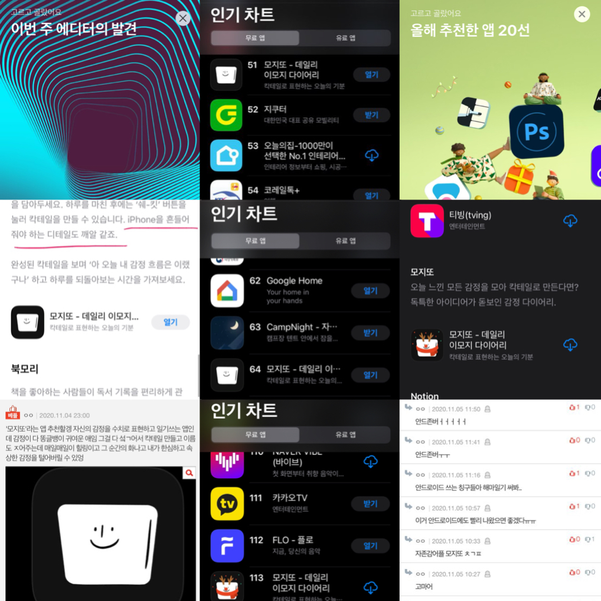

# 2020년, 나는 얼마나 성장했을까

* [서론](#서론)
* [FLO](#FLO)
  * [CMS 개편](#CMS-개편)
  * [이슈 파악](#이슈-파악)
  * [성능 향상 (feat. BTS)](#성능-향상-(feat.-BTS))
  * [Leading 및 5.5.0](#Leading-및-5.5.0)
* [모지또](#모지또)
  * [폭풍 개발](#폭풍-개발)
  * [AppStore](#AppStore)
  * [크리스마스](#크리스마스)
  * [피드백 그리고 안드로이드](#피드백-그리고-안드로이드)
* [마치며](#마치며)

## 서론
2020년은 ```재택```의 연속이었다. 원래 주1회 재택은 가능했지만 코로나로 인해 주2~3회 재택에서 주5일 재택까지 근무 환경이 변했다.
> 처음엔 회사에 출근해서 일하는게 능률이 더 잘 나왔지만, 집에도 모니터 등 재택 근무 여건을 충족시키다보니 지금은 집이 더 효율이 잘 나온다.

그리고 2020년은 개발적으로 규모가 큰 개편 작업, 이슈, 성능 향상, 설계, 리딩을 경험했고, 일 외적으로 하나의 ```도전```을 시작했다. 
더불어 나에게 어떤 것이 부족한지 알게 됐다. 항상 느끼는 거지만 공부에는 끝이 없다. 
> 아! 그리고 ```Tech 멘토```가 생겼다!

---

## FLO

### CMS 개편
올해 가장 큰 숙제였던 CMS 개편을 진행했다. 작게나마 ```TF```를 꾸렸고, 거의 99% 각 팀의 주니어들이 모여서 했다고 봐도 무방할 것 같다.
> 개편의 가장 큰 목적은 유지보수성 향상이었다.

모놀리식 아키텍쳐에서 멀티 서브 모듈 구성의 아키텍쳐로 변경했다. 아키텍쳐 구조를 잡는 건 시니어가 도와주셨다. 
이후 새로운 프로젝트에 datasource, mq 등 config를 붙이고, 공통으로 사용할 모듈과 인프라 모듈을 분리했다. 
간단한 api의 동작을 확인했고 파트를 나눠 본격적인 개편 작업에 돌입했다.
> CMS 개편은 개편대로 진행되고 우리 서비스의 feature는 또 feature대로 진행됐어서 이때 굉장히 힘들었다.

개편 작업이 끝나고 CMS를 사용하는 모든 부서가 QA를 도와줘서 다행히 상용 환경에 올릴 수 있었다. 
하지만, 상용에 올리고 나서 발생하는 이슈들도 꽤 있었어서 한동안 유지보수 하느라 애를 좀 먹었다. 역시 뭐하나 쉬운게 없다. 
> 사실 개인적으로 1차 개편 작업의 끝이고, 이제 CMS 1/N로 나눠서 2차 개편 작업(api 리팩토링)을 해야한다고 생각한다.

그리고 개편 작업을 진행하다 보니 규모가 큰 CMS지만 거의 대부분의 코드를 다 보게 됐고, 히스토리도 알게 되었다.
> 뜻밖의 도메인 지식이 늘어난 느낌... 하지만 너무 많은 걸 알게된 느낌...

개편하면서 이런 저런 이슈도 많이 겪고 했지만, CMS도 MSA 구조로 바꿨으면 어땠을까 하는 생각이 든다. 물론 비용이 좀 많이 들었겠지만... 
아무튼 고생해서 개편한만큼 앞으로는 코드 퀄리티가 낮아지지 않았으면 좋겠다.

### 이슈 파악
정확한 환경과 상황은 적을 수 없지만, MSA 구조에서 ```tracing```이 잘 되지 않는 이슈가 있었다. 
짐작이 가는 부분이 있었지만 실제로 재현해서 확인해봐야 했고 원인을 확실하게 알아야 했는데, 이걸 리더가 하고 있었다. 
그래서 나도 공식 문서도 찾아보고 구글링도 하다보니 확실한 원인을 알게됐다. 
deep하게 파본 덕분에 ```spring cloud sleuth```에 대해서 좀 깊게 알게 됐다.
> 내가 원인 찾은 시점에 리더는 이미 문제 재현할 수 있는 코드짜서 돌리고 있었다...ㅋㅋㅋㅋㅋ
> 그래도 내가 찾은 걸로 코드 한 줄은 수정됐다ㅎㅎ  다음에는 나 혼자서 해결까지 할 수 있기를...

### 성능 향상 (feat. BTS)
성능 향상 겸 BTS의 신보가 나왔을 때 최대 트래픽을 대비할 겸해서 내가 담당하고 있는 도메인에 캐시를 적용했다. 
어떤 방식으로 할지 멘토와 고민하다가 로컬 인 메모리를 사용하기로 했다. 이벤트 기반 갱신과 일정한 주기 갱신 2가지 방법을 혼용하여 적용했다.
캐시를 적용하려다 보니 개인화된 정보는 제외하고 캐싱해야 했기 때문에 로직을 찢어야 했고, 로직 개선 작업도 진행했다. 
결과적으로 나는 4군데에 적용했는데 각각 ```8, 1.8, 10, 4배```의 응답 속도 개선 효과가 있었다. 그리고 BTS 때 안 터졌다.
> 멘토는 천재다. 어떻게 코드를 이렇게 짜지. 나도 멘토처럼 코드를 짜고 싶다.
  
### Leading 및 5.5.0
올해의 마지막 버전이었던 v5.5.0은 ```SDK와 Music Recognition``` 크게 2가지가 있었는데 둘다 참여했다.<br>
SDK API 개발은 커뮤니케이션부터 일정 조율까지 전부 내가 리딩했다. 중간 중간 짜잘하게 변경되는 것과 QA 진행이 스무스하지 않아서 정신적으로 힘들었던 프로젝트... 
Music Recognition은 구간별 time out을 적절하게 잡는 것말고는 딱히 어려운 점이 없었다.
> SDK, Music Recognition 모두 성공적으로 release 돼서 뿌듯하다. 조만간 자동차에서도 FLO를 만날 수 있음.

### 기타
이 밖에도 배지 feature의 DB 구조 설계부터 API 개발까지 진행했다.
> DBA랑 comm하면서 수정하고 했는데 이것도 하나의 재밌는 경험이었다.

---

## 모지또
올해 2월부터 시작한 토이 프로젝트, 나는 백엔드를 담당하고 있는데 사실 이렇게 오래 하게 될 줄 몰랐다.

### 폭풍 개발
폭풍 개발을 시작으로 6월 3일 ios가 앱스토어에 release 되었다. 
sns 홍보를 통해서 유입이 생기기 시작했고, 하루 최대 쉐킷 약 2,000번의 기록을 세웠다.
> 2,000번이라 함은 유니크 한 쉐킷 수. 즉, 당일 2,000명이 쉐킷을 했다는 뜻

### AppStore
ios만 존재하는 앱인데도 불구하고 사용자 수는 생각보다 많았고, 앱 스토어 ```이번 주 에디터의 발견, 인가 차트 순위```에 올라가는 신기한 경험도 할 수 있었다. 
그리고 ```네이트 판, 틱톡```과 같은 커뮤니티, sns에도 모지또를 언급하는 사람들이 존재했다.
> 세상에는 정말 다양한 사람들이 있는 것 같다고 다시 한 번 느끼게 됐다.

### 크리스마스
ios 크리스마스 업데이트도 했다. 

### 피드백 그리고 안드로이드
ios 사용자들의 수많은 ```피드백```과 안드로이드가 나올 때까지 ```숨참는다```는 의견을 많이 볼 수 있었다.
> 우리도 당연히 안드로이드까지 출시하고 싶었고, 그렇게 개발자를 영입했다.

안드로이드 앱을 개발하면서 aos, ios 모두 기능이 추가됐는데 유료 기능까지 있어서 인앱 결제까지 개발하게 됐다. 
> 이니시스 결제를 붙이기엔 진입 장벽이 있을 것 같아 둘다 인앱 결제를 선택했다.

12월 29일 드디어 안드로이드 앱이 플레이 스토어에 release 되었다! ios 유저보다 aos 유저가 훨씬 많기 때문에 사용자가 급증할거라고 예상은 하고 있었지만, 
우리가 홍보도 하지 않았는데 앱이 release 되자마자 요청이 늘어났다.
> 어떻게 이럴 수 있지?

알고봤더니 틱톡에서 우리의 앱을 마침 누군가가 홍보? 언급해줬고, 타이밍이 맞았던 것 같다.
> 근데 틱톡 사용자는 안드로이드가 release 된지 어떻게 안거야..? 신기...

아무튼 안드로이드 출시날 하루 최대 쉐킷 약 5,000번으로 기록을 갱신했다... 
모지또는 AWS 인프라를 사용하고 있는데, 모니터링 해봤을 때 CPU 사용률은 높지 않지만 애플리케이션 서버의 경우 memory가 부족해질 수 있을 것 같아 
정말 active user가 늘어나면 scale up이나 out을 해야할 것 같다...
> 혹시나 모지또 백엔드 같이 하고 싶은 취준생 또는 대학생이 있다면 mingood92@gmail.com으로 연락주세요. MSA는 아니지만 간접적으로나마 실무를 경험해볼 수 있을거에요.

그리고 중요한 건 너무 감사하게도 진짜로 유료 상품을 사는 사람이 있다.
> 서버 비용 벌자.

---

## 마치며
올해에도 열심히 개발했고 개발하면서 다양한 경험을 같이 했다. 회사에서는 올해 마지막 버전 개발을 했고, 
토이 프로젝트는 앱 스토어 올해 추천한 앱 20선에 선정됐다. 그래서 개인적으로 20대 마지막 유종의 미를 거둔 것 같아서 기쁘다. 
하지만 나 스스로 게으르다는 걸 알기 때문에 좀 더 부지런해지려고 노력해야겠다. 그리고 2021년에는 건강한 취미를 생활을 갖고 
어떻게 하면 30대를 재밌게 살 수 있을지 고민할거다. 30대도 20대처럼 살아야지 ㅎㅎ

